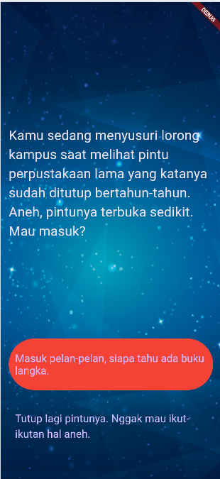

# 📚 Aplikasi Flutter Cerita Interaktif - Perpustakaan Misteri

## 👩‍💻 Pengembang:

- **Nama:** Fitri Atika Salwa  
- **NIM:** 4522210080  
- **Email:** 4522210080@univpancasila.ac.id

---

## 📝 Deskripsi Aplikasi:

**Perpustakaan Misteri** adalah aplikasi Flutter sederhana berbasis cerita interaktif dengan alur bercabang, di mana pengguna memegang kendali penuh atas jalannya cerita melalui dua pilihan yang tersedia pada setiap bagian cerita.

Pengguna akan menjalani kisah sebagai seorang mahasiswa yang penasaran dengan **perpustakaan tua yang sudah lama ditutup**, dan setiap keputusan akan membawa mereka ke akhir cerita yang berbeda—bisa misterius, informatif, bahkan membuat penasaran.

---

## 🧩 Fitur Utama:

- Cerita dengan pilihan ganda (branching story)
- Tiga tahap cerita utama dan tiga kemungkinan akhir
- Tombol otomatis tersembunyi saat hanya ada satu pilihan
- Antarmuka modern berbasis tema gelap
- Ilustrasi latar belakang mendukung suasana cerita

---

## 🖼️ Screenshot Aplikasi:

### 📱 Tampilan Mobile
 



## 📄 Penjelasan Alur Cerita:

1. **Awal Cerita**  
   Kamu menemukan pintu perpustakaan lama yang tak sengaja terbuka. Masuk atau tidak?

2. **Petunjuk Tersembunyi**  
   Jika masuk, kamu akan menemukan buku misterius dan petunjuk menuju tempat rahasia.

3. **Ruang Bawah Tanah**  
   Apakah kamu cukup berani menyusuri ruang bawah tanah kampus? Atau memilih menjauh?

4. **Tiga Akhir Berbeda**  
   - Menerima pesan misterius lewat email  
   - Menemukan arsip rahasia kampus  
   - Mengungkap masa lalu dosen pembimbing

---

## ⚙️ Teknologi yang Digunakan:

- Flutter SDK 3.x
- `MaterialApp` dengan `ThemeData.dark()`
- State Management: StatefulWidget
- Struktur OOP modular (3 file: `main.dart`, `story_brain.dart`, `story.dart`)
- Logika percabangan cerita terstruktur

---

## ▶️ Cara Menjalankan Aplikasi:

```bash
flutter pub get
flutter run
